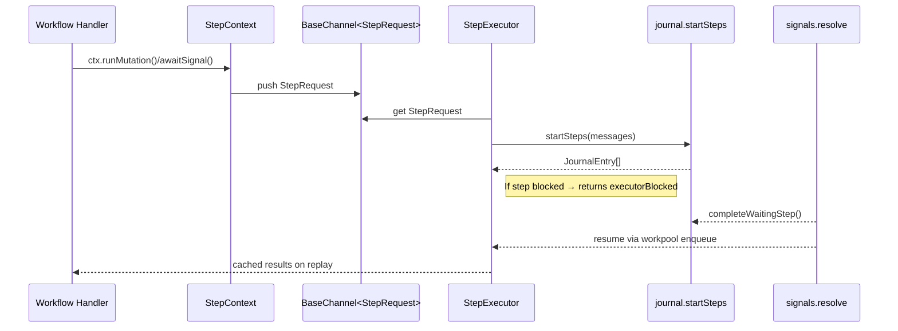
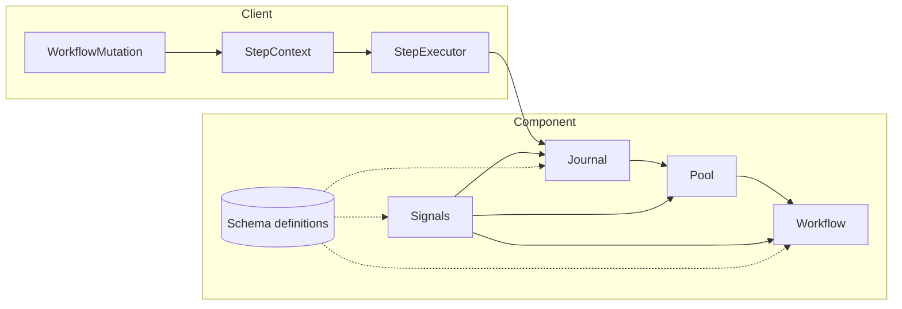

# Findings
- **`steps` table contents**: defines `steps` as a journal of every workflow step, capturing `args`, `runResult`, timestamps, and metadata for execution, pause, and signal steps (`step.step.*` fields hold inputs/outputs).
- **Step creation path**: Helpers like `ctx.runMutation`, `ctx.runQuery`, `ctx.runAction`, `ctx.pause`, and `ctx.signals.awaitSignal` in `packages/convex-workflow/src/client/stepContext.ts` push `StepRequest`s onto a `BaseChannel<StepRequest>` queue created in `packages/convex-workflow/src/client/workflowMutation.ts`. This async channel (from the `async-channel` package) buffers step requests so the workflow handler can enqueue work while the `StepExecutor` consumes them in order.
- **Persistence layer**: `StepExecutor.startSteps()` in `packages/convex-workflow/src/client/step.ts` batches those requests and writes them via `component.journal.startSteps` (`packages/convex-workflow/src/component/journal.ts`), which inserts entries into the `steps` table.
- **ExecutionModel**: Replay-driven workflow mutation in `packages/convex-workflow/src/client/workflowMutation.ts` races the handler and executor; success with `handlerDone` completes via `component.workflow.complete`, whereas `executorBlocked` means the handler paused on a step and must not mark completion.
- **StepReplay**: `packages/convex-workflow/src/client/step.ts` reuses journaled steps to ensure idempotency; blocking steps (signals, pauses, actions) suspend execution via journal entries until resumed.
- **HandlerContext**: `packages/convex-workflow/src/client/stepContext.ts` exposes `ctx.signals.create`/`ctx.signals.awaitSignal` along with run utilities; these must pass through the replay-aware executor to avoid duplicate side effects.
- **SignalLifecycle**: `packages/convex-workflow/src/component/signals.ts` handles creation (idempotent check by workflow/name), resolution/rejection, and workflow resumption; `waitingStepId` links awaiting steps to signal documents.
- **JournalIntegration**: `packages/convex-workflow/src/component/journal.ts` starts steps, records `waitingStepId`, and resumes workflows when step results arrive.
- **PoolCallbacks**: `packages/convex-workflow/src/component/pool.ts` differentiates handler failure (triggers `component.workflow.completeHandler`) from success (just indicates blocking) to prevent premature completion.
- **CompletionFlow**: `packages/convex-workflow/src/component/workflow.ts` owns workflow document lifecycle, ensuring final `runResult` is preserved once handler genuinely finishes.
- **DebuggingInsights**: `docs/workflow-signals-debugging-story.md` captures critical bugs (premature completion, non-idempotent signal creation) and their fixes, plus a timeline showing correct replay across multiple signal resolutions.

**Workflow replay flow:**

**Component architecture:**

- **[workflowMutation.ts]** The mutation loads workflow/journal via **[component.journal.load]**, builds a **[StepContext]** and **[StepExecutor]**, then races **[handlerWorker()]** against **[executor.run()]**. On **handlerDone**, it writes final result through **[component.workflow.complete]**; on **executorBlocked**, it leaves execution suspended until a step resumes.
- **[stepContext.ts]** Provides the handler’s API: **signals.create** routes to **[component.signals.create]** (handling predeclared/dynamic validators), **[signals.awaitSignal]** pushes a **[SignalAwaitRequest]** onto the channel (optionally with **timeoutMs**), and helper **runMutation/runAction/runQuery/pause** enqueue execution steps through **[StepExecutor]**.
- **[step.ts]** Replays journaled steps first (**completeMessage** verifies args and returns cached results). For new steps it batches channel messages, calls **[component.journal.startSteps]**, and returns **executorBlocked** if any **step.step.inProgress** remains. Also enforces the 8 MiB journal cap and populates signal step metadata (**timeoutMs**, etc.).
- **[signals.ts]** Implements idempotent creation (lookup by **workflowId** + **name** via index), resolution/rejection/cancellation with validator enforcement, step completion via **[completeWaitingStep]**, and re-enqueueing through **[resumeWorkflow]** → workpool → **internal.pool.handlerOnComplete**. Includes internal timeout handler wired to journal scheduling.
- **[journal.ts]** **[startSteps]** inserts step docs, updates signal **waitingStepId**, schedules workpool items (execution, pause side-effects, signal timeouts), and logs **started** events. **[load]** streams the ordered journal with size guard. **resume** resumes paused steps similar to signals, then re-enqueues the workflow mutation.
- **[pool.ts]** Wraps **@convex-dev/workpool**: **onComplete** finalizes step entries, logs status, and re-enqueues the workflow mutation; **handlerOnComplete** now only invokes **[workflow.completeHandler]** on non-success results, preventing premature completion.
- **[workflow.ts]** Owns lifecycle: **create** inserts workflow and optionally starts async; **[completeHandler]** persists **runResult**, bumps generation on cancel, optionally triggers **onComplete** hook, and cancels in-flight work. **getStatus**, **[cancel]**, **cleanup** provide operational APIs.
- **[schema.ts]** Defines tables/indexes: **workflows**, **steps** (with **workflow** and **inProgress** indexes), **signals** (indexed by **workflow** + **state** + **name** to enable idempotent lookup and state scans), plus helper size calculators used for limits.

# Implementation Insights
- **Replay safety** Everything that mutates persistent state during handler execution flows through **[StepExecutor]** and **[journal.startSteps]**, guaranteeing idempotency across replays.
- **Signal timeout path** **SignalAwaitRequest.timeoutMs** bubbles into **[journal.startSteps]**, which schedules **internal.signals.handleTimeout**. That mutation marks the signal rejected, clears **waitingStepId**, and resumes workflow—illustrating built-in timeout handling.
- **Workpool coordination** Both step completion and signal resolution enqueue the workflow handler mutation with **internal.pool.handlerOnComplete** as **onComplete**, ensuring resume semantics remain centralized.

# Status
Inspected the referenced client and component implementation files under `packages/convex-workflow/`, captured architecture details, and identified follow-up questions. Ready to dive deeper or extend features as needed.